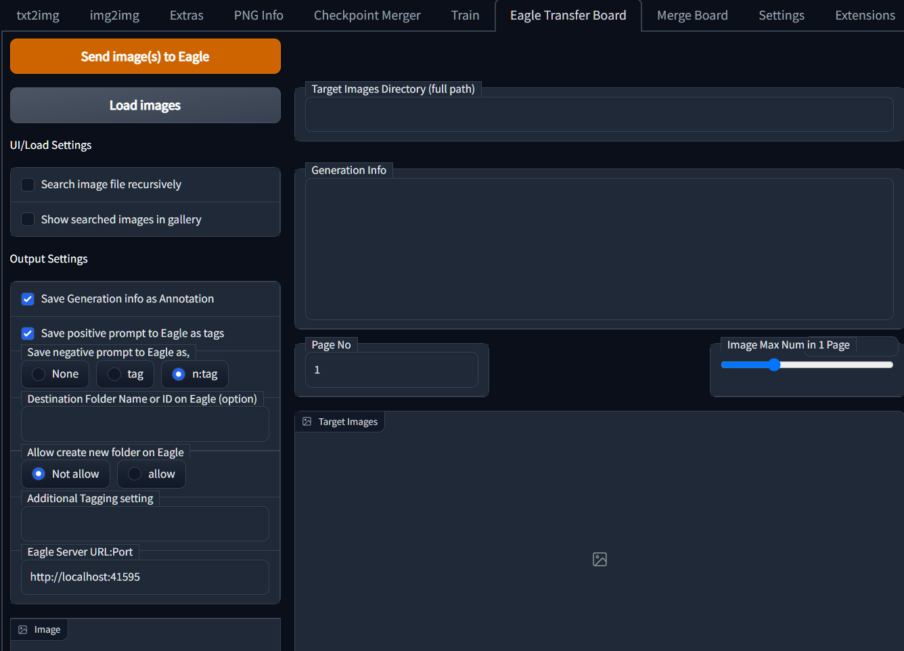
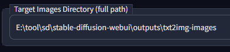
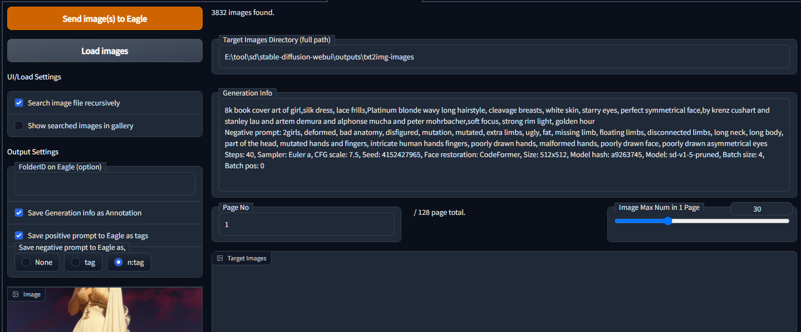
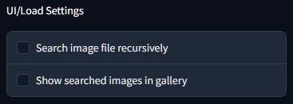
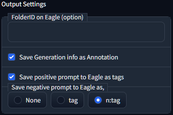

# Eagle transfer

[日本語 README](README_ja.md)

- This is Extension for [AUTOMATIC1111's Stable Diffusion Web UI](https://github.com/AUTOMATIC1111/stable-diffusion-webui)

- Send images in directory to [Eagle - image management software](https://jp.eagle.cool/), with prompt/negative prompt and generation info.

## How to install

- Go to `Extensions` tab on your web UI
- `Install from URL` with this repo URL, and Install

## How to use

|                      |                                                              |
| -------------------- | ------------------------------------------------------------ |
|    | Select "Eagle Transfer" tab                                  |
|  | Input directory path, push "Load images" button (option) |
|  |                                                              |
|  | Push "Send image(s) to Eagle" button to start transfer       |

## About Settings

| UI / Load Settings              |                                                     |
| ------------------------------- | --------------------------------------------------------------------- |
| Search image file recursively   | Search images under "Target Images Directory", include sub-directory. |
| Show searched images in gallery |                                                                       |

| Output Settings                       |                                                                                                                                                                   |
| ------------------------------------- | ----------------------------------------------------------------------------------------------------------------------------------------------------------------------------------- |
| FolderID on Eagle                     | (option) Select folder on Eagle by ID.                                                                                                                                          |
| Save Generation info as Annotation    | Register PNGinfo like 3line generation info to "memo" on Eagle.                                                                                                                     |
| Save positive prompt to Eagle as tags | Register prompt as "tag" on Eagle.                                                                                                                                                  |
| Save negative prompt to Eagle as      | Register negative prompt as "tag" on Eagle None: disabled tag: register normal style. i.e.) "bad anatomy" n:tag : Register tag with "n:" on head. i.e.) "n:bad anatomy" |
