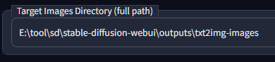

# Eagle transfer

[English README](README.md)

- [AUTOMATIC1111's Stable Diffusion Web UI](https://github.com/AUTOMATIC1111/stable-diffusion-webui) 用の Extensionです

- 既にある画像ファイルを、お手元の PC で起動している [Eagle - image management software](https://jp.eagle.cool/) アプリへ転送・登録します
  
   - 転送登録時、PNGinfo に表示される生成情報を取り出し、タグ・メモとして付記します

- WebUI で新しく生成する画像を即座に転送したい場合は、[こちらの別Extension](https://github.com/bbc-mc/sdweb-eagle-pnginfo) をどうぞ

## インストール方法

- `Extensions` タブを開く

- `Install from URL` にこのリポジトリの URL を入力し、Install

## 使用方法

|                                           |                                                                      |
| ----------------------------------------- | -------------------------------------------------------------------- |
|                         | Tab にて "Eagle Transfer" を選択                                          |
|   | 画像フォルダパスを入力して、”Load images" ボタンを押下 (option)                          |
|                       | - 画面上部に、読み込んだ画像枚数が表示されます - 読み込んだ画像のうち、最初の一枚から生成情報を取り出し、サンプルとして表示 |
|                       | "Send image(s) to Eagle" ボタンを押下すると、画像転送を実行                           |

## 設定

### 画面 / 読込設定

| UI / Load Settings              |                                             |
| ------------------------------- | ------------------------------------------------------------- |
| Search image file recursively   | Target Images Directory で指定されたフォルダ以下について、サブディレクトリを含めて画像を検索します |
| Show searched images in gallery | 検索して見つけた画像ファイルを、画面下部のギャラリーに表示します                              |

### 出力設定

| Output Settings                       |                                                                                                               |
| ------------------------------------- | ------------------------------------------------------------------------------------------------------------------------------- |
| Save Generation info as Annotation    | PNGinfo に表示されるような、3行からなる生成情報を、Eagle の メモ欄に登録します                                                                                 |
| Save positive prompt to Eagle as tags | プロンプトを Eagle の tag として登録します                                                                                                     |
| Save negative prompt to Eagle as      | ネガティブプロンプトを Eagle の tag として登録します None: 登録しません tag: 登録します n:tag 登録します。登録時、タグ名の頭に "n:" をつけ、通常のプロンプトの tag と判別できるようにします |
| FolderID on Eagle                     | (option: 必須ではありません) 画像を登録する Eagle 側のフォルダID を指定できます                                                                          |
| Allow create new folder               | 指定された名前のフォルダが Eagle に存在しない場合に、新しくフォルダを作成するかを設定できます                                                                              |
